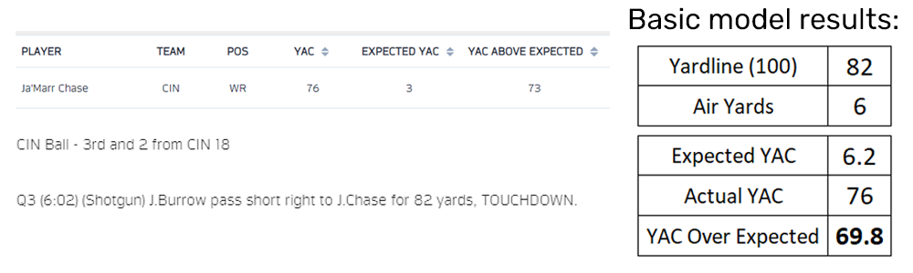
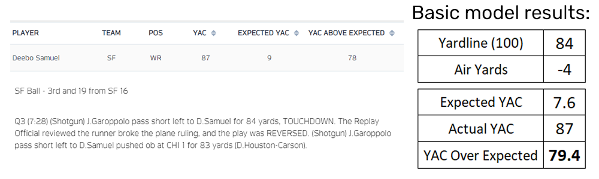
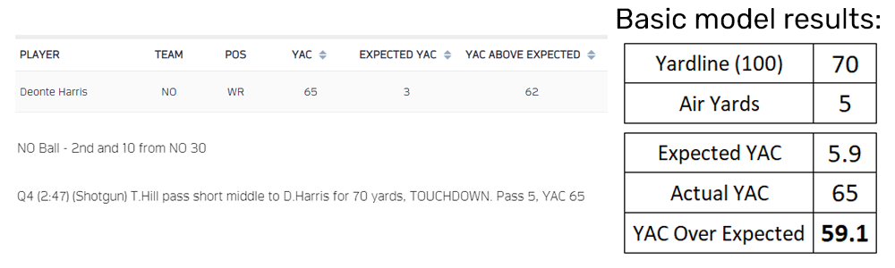

# YAC Over Expecation Using R, SQL, and Excel

These are the materials for my basic yards after catch over expectation model using 2021 NFL regular season data.

## Process

- Use [step1_nflfastR.r](https://github.com/jbrooksdata/basic-yac-expectation-model/blob/main/step1_nflfastR) to obtain play-by-play data for the 2021
NFL season, or any years of your choosing.
- Once exported as a .csv, the data can then be brought into SQL Server by right-clicking a database and using Tasks > Import Flat File...
or by importing the file into Excel.
- If utilizing SQL Server, [step2_selectvalues.sql](https://github.com/jbrooksdata/basic-yac-expectation-model/blob/main/step2_selectvalues.sql) can then be used to narrow the data
to just the necessary columns for modeling.
- Upon collection, this data should be brought into Excel where a standard regression model will be applied using the Analysis ToolPak.
  - Analysis ToolPak installation instructions can be found [here](https://support.microsoft.com/en-us/office/load-the-analysis-toolpak-in-excel-6a63e598-cd6d-42e3-9317-6b40ba1a66b4).
- The resulting coefficients can be used to generate a number of expected yards after catch for a given yardline location and number of air yards.
  - The formula for this is (given yardline * yardline coefficient) + (given air yards + air yards coefficient) + (intercept) = expected YAC.
- This number can be subracted from the actual yards after catch to calculate a play or player's YAC over expectation.

## Results

Despite its simplicity, this regression model did a passable job at replicating results of the Next Gen Stats model.
Using Next Gen Stats' top 3 [plays sorted by YAC above expected](https://nextgenstats.nfl.com/stats/top-plays/yac/2021/REG/all), I entered yardline location, air yards, and yards after catch
to find each play's YAC over expectation as determined by my model.

In week 7, Ja'Marr Chase caught a short pass from Joe Burrow that the quick receiver turned into an 82-yard touchdown to put the Bengals ahead 27-17
The Next Gen Stats model (info on the left) calculated 3 expected YAC that turned into 76, or 73 over expected. The simple regression model (on the right)
expected 6.2, with Chase generating 69.8 YAC over expectation.

49ers receiver Deebo Samuel caught a pass 4 yards behind the line of scrimmage that looked to be an 87-yard touchdown before a review and reversal marked him down just short of the goalline.
The model was even closer for this week 8 play, returning 7.6 expected YAC to Next Gen Stats' 9, and 79.4 over expected to NGS' 78.

Finally, New Orleans' Deonte Harris turned a 5-yard pass from Taysom Hill into a 70-yard touchdown in a 17-27 loss to the Dallas Cowboys.
As shown, the model returned an expected YAC of 5.9 giving Harris 59.1 YAC over expectation on this play.

## Limitations

- This is a very simple regression model using two independent variables (yardline and air yards) that do not necessarily have a direct effect on yards after catch.
- The R data referenced here is that of only one NFL regular season. Data from multiple seasons could be easily gathered with a simple modification to the load_pbp() function in
[step1_nflfastR.r](https://github.com/jbrooksdata/basic-yac-expectation-model/blob/main/step1_nflfastR).
- NFL Next Gen Stats [directly references](https://nextgenstats.nfl.com/stats/top-plays/yac/2021/REG/all) the use of metrics like receiver speed, separation, and defender location.
This information is not available through the utilized nflfastR function.

## Conclusion

Overall, this basic model was decently effective at returning similar YAC above expected numbers to those of the NFL's Next Gen Stats advanced model. I plan to introduce other variables available in the nflfastR package in the future to observe how various factors may affect the expected yards after catch in any given situation

## References

- [nflfastR package](https://www.nflfastr.com/) by [Sebastian Carl](https://twitter.com/mrcaseb) and [Ben Baldwin](https://twitter.com/benbbaldwin).
- [NFL Next Gen Stats](https://nextgenstats.nfl.com/).
